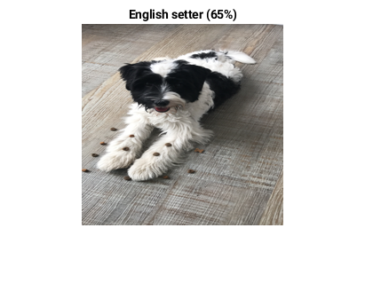
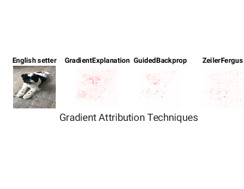
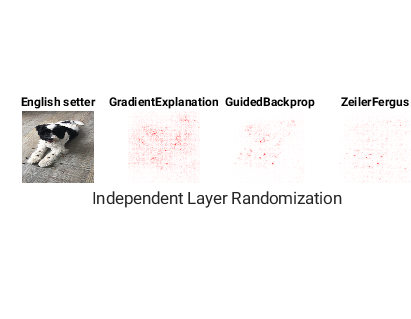
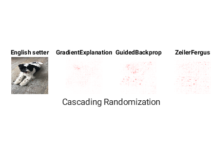

# Compare Gradient Attribution Maps


This repository provides several ways of computing gradient attribution maps to investigate which parts of an image are most important for classification decisions made by a deep neural network. This repository also provides sanity checks for evaluating the gradient attribution maps.


# Overview


As convolutional neural networks (CNNs) become more prevalent, it is important to understand how they make predictions. For example, which parts of the input data does the network use to make a classification decision? Saliency maps can help to understand this problem.


A saliency map, also known as a gradient attribution map, identifies the important pixels in the input image that a network uses to make a prediction. One method of producing saliency maps is by gradient attribution. Gradient attribution computes the gradient of the outputs score with respect to each pixel in the image to provide a map of the pixels that strongly affect the output classification score. 


It is also important to perform sanity checks on the gradient attribution methods, to ensure the maps are providing accurate information about the network. Adebayo et al. [1] have shown that some saliency maps that are visually appealing are not logically correct.


This repository provides functions to help generate saliency maps and also to perform sanity checks on the gradient attribution techniques.


# Usage


This repository requires [MATLAB](https://www.mathworks.com/products/matlab.html) (R2020a and above) and the [Deep Learning Toolbox](https://www.mathworks.com/products/deep-learning.html).


The repository provides the following functions:


   -  `gradientMap` — Computes a saliency map for a network and image using three different gradient attribution techniques (gradient explanation, guided backpropagation, Zeiler-Fergus) 
   -  `AttributionReluLayer` — Modified ReLU layer required in the guided backpropagation and Zeiler-Fergus techniques 
   -  `parameterRandomization` — Randomize network parameters for sanity checks 
   -  `randomizeLearnableParameters` — Randomize parameters of a layer. Used in the `parameterRandomization` function 
   -  `tileInputAndMaps` — Display input image and saliency maps 

# Getting Started


To get started, clone this repository and use the following example code. This example code is provided in the file CompareGradientAttributionMapsExample.mlx.


## Import Network and Sample Image


Load the pretrained SqueezeNet network. Load the example image `anansi.jpg` and resize the image to the network input size.


```matlab:Code
net = squeezenet;
inputSize = net.Layers(1).InputSize(1:2);
img = imread("images/anansi.jpg");
img = imresize(img,inputSize);
```


Classify the image and display the predicted label and the confidence score.


```matlab:Code
[YPred,scores] = classify(net,img);
confidence = max(scores);

figure
imshow(img)
title(sprintf("%s (%.0f%%)",YPred,confidence*100))
```





The dog in the image is actually a Tibetan terrier but the image has been misclassified as an English setter. For our use case, this is still fine as we are interested in the pixels that contributed to the prediction.


## Gradient Attribution Techniques


Gradient attribution techniques compute the gradient of the output score with respect to the input image. The `gradientMap` function takes as input the network, the sample image, and three different options for different gradient attribution techniques. The function provides the following three different gradient attribution methods.


### Gradient Explanation


Calculates the gradients of the predicted class score with respect to the input image. The gradients represent how much the image pixels contribute to the prediction and how much changes in the pixel affect the score. The attribution map is the same size as the image.


### Guided Backpropagation


The attribution map is sharpened by setting elements of the gradients that are less than zero in the ReLU layers to zero.  This means that pixel elements that do not contribute towards prediction are discarded. This is defined as


0)*(\frac{\delta&space;L}{\delta&space;Z}>0)*\frac{\delta&space;L}{\delta&space;Z}"/>


where  is the loss,  the input to the ReLU and  the output of the ReLU layer.


### Zeiler Fergus


Similar to guided backpropagation, this technique sharpens the attribution map by using a modified ReLU layer in its backpropagation. Here, the backwards function is defined as


0)*\frac{\delta&space;L}{\delta&space;Z}"/>


Calculate saliency maps using the three different techniques.


```matlab:Code
ge_map = gradientMap(net,img,'GradientExplanation');    
gb_map = gradientMap(net,img,'GuidedBackprop');
zf_map = gradientMap(net,img,'ZeilerFergus');
```


The gradient maps are single channel maps. The three channels of the image are reduced to one by summing the absolute value of the gradient across all channels and rescaling to a value between `0` and `1`. The map therefore shows a greyscale image of the pixels that have a strong positive or negative effect on the classification score.  


Define a colormap to use to display the attribution maps in a readable format.


```matlab:Code
cmap = [ones(255,1) linspace(1,0,255)' linspace(1,0,255)']*255;
cmap = uint8(cmap);
```


Plot the original image and the three different saliency maps using the `tileInputAndMaps` function.


```matlab:Code
tileInputAndMaps(img,{ge_map, gb_map, zf_map},{YPred,'GradientExplanation','GuidedBackprop','ZeilerFergus'},cmap,"Gradient Attribution Techniques");
```




## Sanity Checks by **Model Parameter Randomization**


Using sanity checks, we can evaluate the usefulness of the three gradient attribution techniques. Here, the gradient attribute techniques are evaluated using the model parameter randomization technique proposed by Adebayo et al. [1] ([Sanity Checks for Saliency Maps repository on GitHub](https://github.com/adebayoj/sanity_checks_saliency)). 


The idea here is that, given a network with random weights and biases, you can compute a saliency map using this randomized network and compare with the saliency map computed using the trained network. If the saliency method depends on the weights and biases of a network then both outputs should differ, and you have learned something about the way your network interprets the input data. If the outputs are very similar, then the saliency method does not depend on the parameters of the network and probably depends only on the data, **most likely performing edge detection.**


Here, two methods of model parameter randomization are presented.


### **Independent Layer Randomization**


By randomizing a single layer, you can isolate the dependence of the gradient attribution maps to individual layers. 


```matlab:Code
net.Layers(end-9:end)
```


```text:Output
ans = 
  10x1 Layer array with layers:

     1   'fire9-relu_expand1x1'              ReLU                     ReLU
     2   'fire9-expand3x3'                   Convolution              256 3x3x64 convolutions with stride [1  1] and padding [1  1  1  1]
     3   'fire9-relu_expand3x3'              ReLU                     ReLU
     4   'fire9-concat'                      Depth concatenation      Depth concatenation of 2 inputs
     5   'drop9'                             Dropout                  50% dropout
     6   'conv10'                            Convolution              1000 1x1x512 convolutions with stride [1  1] and padding [0  0  0  0]
     7   'relu_conv10'                       ReLU                     ReLU
     8   'pool10'                            Global Average Pooling   Global average pooling
     9   'prob'                              Softmax                  softmax
    10   'ClassificationLayer_predictions'   Classification Output    crossentropyex with 'tench' and 999 other classes
```


The second-to-last convolutional layer is named `fire9-expand3x3`. This is the 60th layer in the SqueezeNet architecture. Randomize the learnable parameters of this layer using the function `randomizeModelParameters`. 


```matlab:Code
layerIndx = 60;
randomizeLayerNet = randomizeModelParameters(net,layerIndx);
```


Use the resulting network to compute the saliency maps using the three gradient attribution techniques. You can calculate all of the maps at the same time by providing the list of techniques as a cell array. 


```matlab:Code
mapsLayer = gradientMap(randomizeLayerNet,img,{'GradientExplanation','GuidedBackprop','ZeilerFergus'});
tileInputAndMaps(img,mapsLayer,{YPred,'GradientExplanation','GuidedBackprop','ZeilerFergus'},...
    cmap,"Independent Layer Randomization");
```




### **Cascading Randomization**


You can also randomize several layers at once using the `randomizeModelParameters` function. To do this, provide an additional input argument that specifies the number of layers to randomize after the original specified layer.  The `randomizeModelParameters` function simply skips any layer that it cannot randomize.


Randomize the learnable parameters of the last eight layers using the `randomizeModelParameters` function. Within this range, only the two convolutional layers have learnable parameters. 


```matlab:Code
numLayers = 7;
cascadeRandomizedModel = randomizeModelParameters(net,layerIndx,numLayers);
mapsCascade = gradientMap(cascadeRandomizedModel,img,{'GradientExplanation','GuidedBackprop','ZeilerFergus'});
```


```matlab:Code
tileInputAndMaps(img,mapsCascade,{YPred,'GradientExplanation','GuidedBackprop','ZeilerFergus'},...
    cmap,"Cascading Randomization");
```





By comparing the different saliency maps for the pretrained network and the networks with randomized parameters, you can see which of the gradient attribution techniques rely on the network parametes, rather than the input image. Only the gradient explanation technique shows significant changes between the trained and randomized networks. The saliency maps from the guided backpropagation and Zeiler-Fergus techniques stay consistent across the different networks. These techniques appear to be more dependent on the input image than the network, which means they might not be useful for understanding how a network makes classification decisions. 


# References


[1] Adebayo, Julius, Justin Gilmer, Michael Muelly, Ian Goodfellow, Moritz Hardt, and Been Kim. “Sanity Checks for Saliency Maps.” In *Proceedings of the 32nd International Conference on Neural Information Processing Systems*, 9525–9536. NIPS’18. Montréal, Canada: Curran Associates Inc., 2018.


